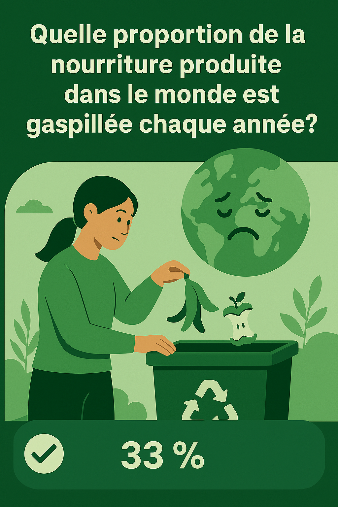

# ♻️ Quiz Interactif – Gaspillage Alimentaire

> Un quiz ludique pour sensibiliser au gaspillage alimentaire à travers 10 questions visuelles et interactives.


---

## 🎮 Démo

➡️ **[Voir la démo en ligne](https://florian-huyghe.github.io/Quiz-IA-for-good/)**

---

## 🧠 Fonctionnalités

- ✅ 10 questions à choix multiples sur le gaspillage alimentaire
- 📷 Une image de feedback affichée après chaque réponse
- 🔍 Affichage immédiat des bonnes/mauvaises réponses
- 🧾 Score final visible à la fin du quiz
- 📱 Compatible mobile (responsive)
- 🛠 Facilement modifiable

---

## 🖼️ Aperçu


<em>Image d'exemple affichée après une réponse</em>

---

## 🗂️ Structure du projet

```

Quiz-IA-for-good/
├── index.html              # Page principale
├── style.css               # Feuille de styles
├── script.js               # Logique du quiz
├── images/
│   └── easy/
│       ├── image01.png
│       ├── image02.png
│       └── ... jusqu'à image10.png


---

## 🚀 Lancer le projet en local

1. Clone ce dépôt :
   ```bash
   git clone https://github.com/florian-huyghe/Quiz-IA-for-good.git
   cd Quiz-IA-for-good
   ```

2. Ouvre `index.html` dans ton navigateur :

   * Double-clique sur le fichier `index.html`, ou
   * Lance-le avec une extension comme *Live Server* dans VS Code.

---

## ✏️ Personnalisation

* Les **questions** peuvent être modifiées dans `script.js`, dans le tableau `questions`.
* Les **images de feedback** se trouvent dans `/images/easy/` et sont nommées de `image01.png` à `image10.png`.
* Le style visuel peut être modifié dans `style.css`.

---

## 📚 Objectif pédagogique

Ce quiz a été conçu dans le cadre d’un projet **éducatif** pour encourager la **réduction du gaspillage alimentaire** à travers l’interactivité et la réflexion.

---

## 📄 Licence

Distribué sous licence MIT. Voir [`LICENSE`](LICENSE) pour plus de détails.

---

## 🙋‍♂️ Auteur

**Florian Huyghe**
Étudiant en cybersécurité passionné par la technologie.
🔗 [Voir la démo](https://florian-huyghe.github.io/Quiz-IA-for-good/)

---

## 🌟 À faire (TODO)

* [ ] Ajouter un système de chronomètre
* [ ] Animer les images de feedback
* [ ] Ajouter un bouton "Recommencer"
* [ ] Stocker le score dans le `localStorage`

```